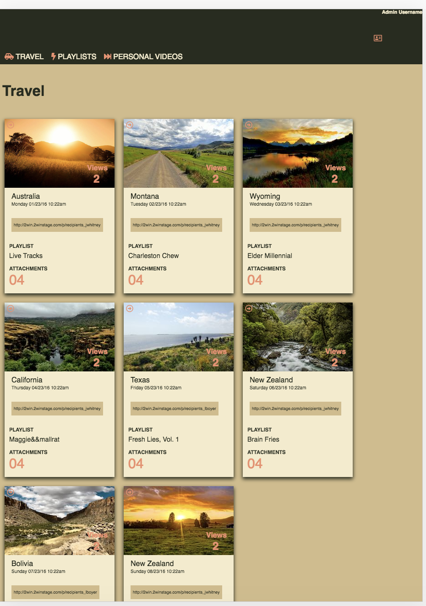
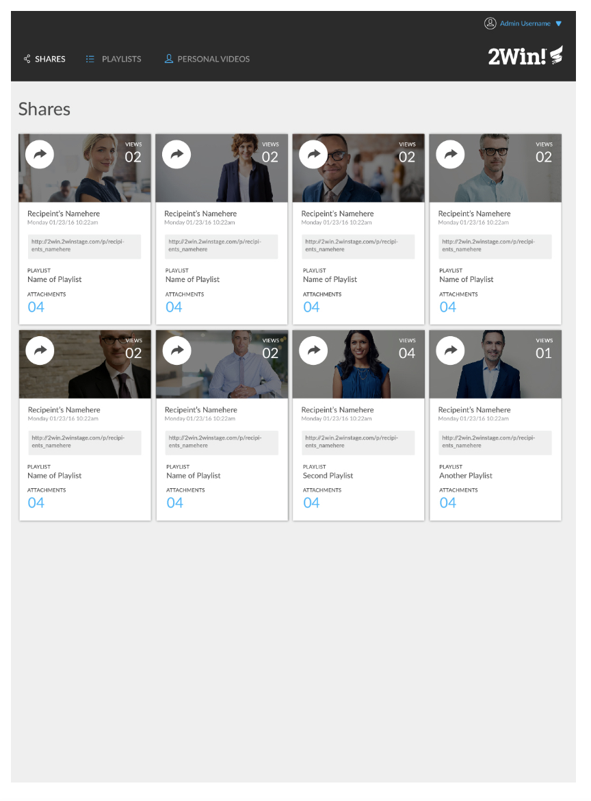

<h2> This is my static-comp</h2>

<h2> This is the static-comp given by</h2>

This is a static-comp that was given by turing. We were instrtucted to make it in the card ui format, but make it more individualized. The hardest part of this project was making it responsive to different media screen sizes and the easiest part of the project was getting to use a flex-box.
